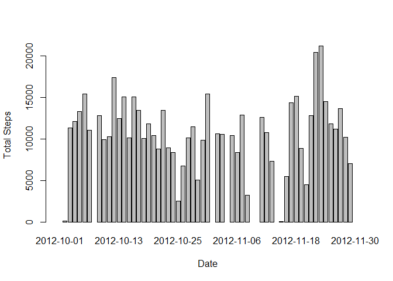
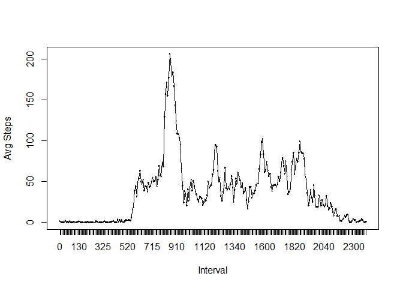
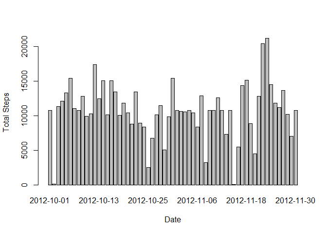
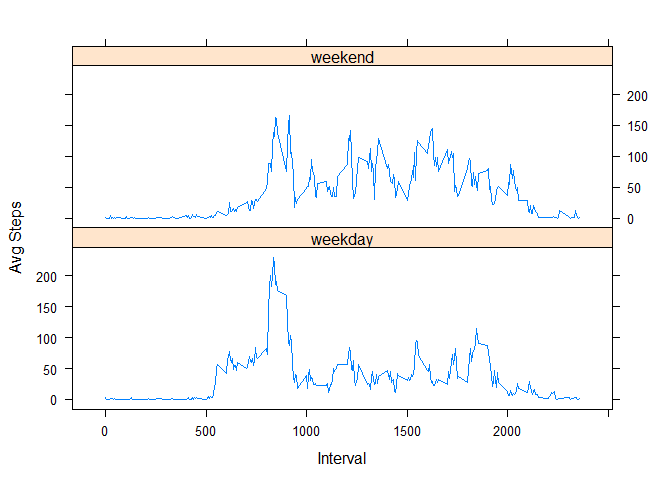

# Reproducible Research: Peer Assessment 1

## Loading and preprocessing the data

First, we load the data.


```r
temp <- tempfile();
download.file("https://d396qusza40orc.cloudfront.net/repdata%2Fdata%2Factivity.zip",temp);
activity <- unzip(temp,"activity.csv");
activity <- read.csv(activity);
file.remove("activity.csv")
```

```
## [1] TRUE
```

Then, we load the libraries we will use to complete the analysis.


```
## 
## Attaching package: 'dplyr'
```

```
## The following objects are masked from 'package:stats':
## 
##     filter, lag
```

```
## The following objects are masked from 'package:base':
## 
##     intersect, setdiff, setequal, union
```

```
## 
## Attaching package: 'lubridate'
```

```
## The following object is masked from 'package:base':
## 
##     date
```

## What is mean total number of steps taken per day?

1. Make a histogram of the total number of steps taken each day.


```r
step_sum <- aggregate(activity$steps,list(as.factor(activity$date)),sum);
barplot(step_sum$x,names.arg = step_sum$Group.1,xlab = "Date",ylab = "Total Steps")
```

<!-- -->

2. Calculate and report the **mean** total number of steps taken each day.


```r
mean(step_sum$x,na.rm=TRUE)
```

```
## [1] 10766.19
```

The mean total number of steps taken each day is 10,766.

3. Calculate and report the **median** total number of steps taken each day.


```r
median(step_sum$x,na.rm=TRUE)
```

```
## [1] 10765
```

The median total number of steps taken each day is 10,765.

## What is the average daily activity pattern?

1. Make a time series plot of the 5-minute interval (x-axis) and the average number of steps taken, averaged across all days (y-axis).


```r
daily <- aggregate(activity$steps,list(as.factor(activity$interval)),mean,na.rm=TRUE);
plot(daily$Group.1,daily$x,xlab="Interval",ylab = "Avg Steps");
lines(daily$Group.1,daily$x,type="l")
```

<!-- -->

2. Which 5-minute interval, on average across all the days in the dataset, contains the maximum number of steps?


```r
max_avg <- max(daily$x);
max_daily <- daily[daily$x==max_avg,];
max_daily <- rename(max_daily,Interval = Group.1,Max_Steps = x);
max_daily
```

```
##     Interval Max_Steps
## 104      835  206.1698
```

On average over this time period, the most steps are taken at around the 835 minute interval.

## Imputing missing values

1. Calculate and report the total number of missing values in the dataset.


```r
sum(is.na(activity$steps))
```

```
## [1] 2304
```

There are 2,304 missing values in the dataset.

2. Devise a strategy for filling in all of the missing values in the dataset and create a new dataset that is equal to the original dataset but with the missing data filled in.


```r
activity2 <- subset(activity,is.na(activity$steps)==FALSE);
activity3 <- subset(activity,is.na(activity$steps)==TRUE)
activity3 <- select(activity3,2:3)
activity3 <- merge(activity3,daily,by.x="interval",by.y="Group.1",all.x=TRUE)
activity3 <- activity3[,c(3,2,1)]
activity3 <- rename(activity3,steps = x);
new_activity <- rbind(activity2,activity3)
```

3. Make a histogram of the total number of steps taken each day using the new dataset.


```r
step_sum2 <- aggregate(new_activity$steps,list(as.factor(new_activity$date)),sum);
barplot(step_sum2$x,names.arg = step_sum2$Group.1,xlab = "Date",ylab = "Total Steps")
```

<!-- -->

4. Calculate and report the **mean** total number of steps taken per day using the new dataset. 


```r
mean(step_sum2$x,na.rm=TRUE)
```

```
## [1] 10766.19
```

The mean value in the new dataset is 10,766 steps. 

5. Calculate and report the **median** total number of steps taken per day using the new dataset.


```r
median(step_sum2$x,na.rm=TRUE)
```

```
## [1] 10766.19
```

The median value in the new dataset is 10,766 steps.

**Do these values differ from the estimates from the first part of the assignment? What is the impact of imputing missing data on the estimates of the total daily number of steps?**

The mean value for total steps taken per day is the same for both datasets. The main difference is in the total value of steps across all days.

## Are there differences in activity patterns between weekdays and weekends?

1. Create a new factor variable in the dataset with two levels -- "weekday" and "weekend" indicating whether a given date is a weekday or weekend day.


```r
new_activity$date <- ymd(new_activity$date);
new_activity <- mutate(new_activity,daytype = weekdays(new_activity$date));
new_activity$daytype <- as.factor(new_activity$daytype);
levels(new_activity$daytype) <- c("weekday","weekday","weekend","weekend","weekday","weekday","weekday")
```

2. Make a panel plot containing a time series plot (i.e.  type = "l" ) of the 5-minute interval (x-axis) and the average number of steps taken, averaged across all weekday days or weekend days (y-axis).


```r
daily2 <- aggregate(new_activity$steps,list(new_activity$daytype,new_activity$interval),mean,na.rm=TRUE);
xyplot(x~Group.2 | Group.1,data=daily2,type = "l",layout = c(1,2),xlab="Interval",ylab="Avg Steps")
```

<!-- -->

**Are there differences in activity patterns between weekdays and weekends?**

Yes, during the week, the daily step volume is much higher between the 800 and 850 minute intervals than at any other time in the day. During the weekend, daily step volume is more evenly distributed across time intervals and is higher for many intervals than the daily weekday step volume. This indicates a person who is more active during weekend days than week days, perhaps a person with a job that does not require much walking.

